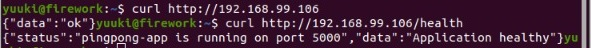
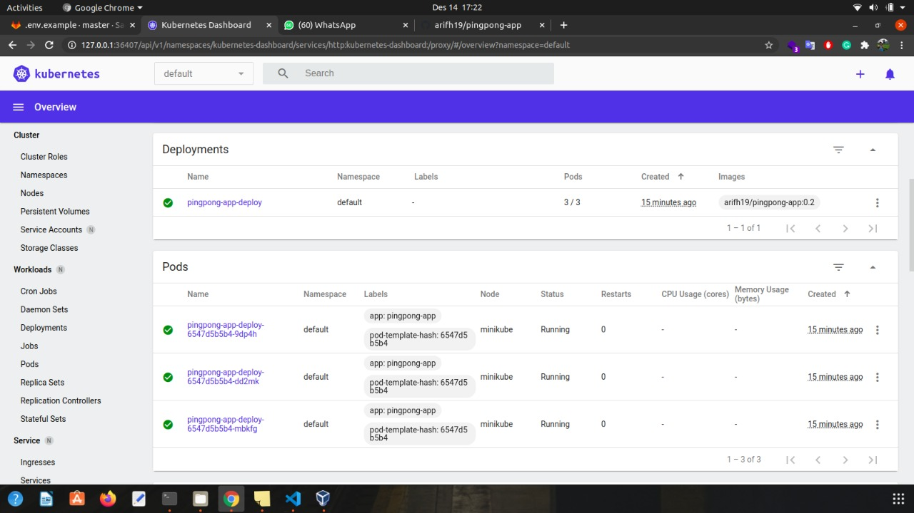
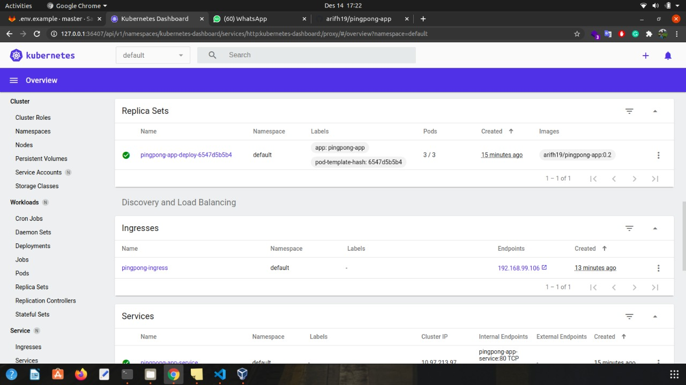
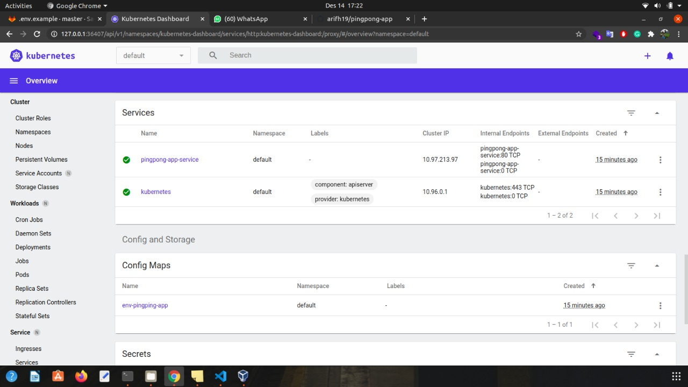

# Pingpong App

### Tech

Dillinger uses a number of open source projects to work properly:

- [NodeJS] - Runtime environment javascript
- [Docker] - For Dockerize
- [Kubernetes] - For managing containerized workloads and services

### Requirement

- [Minikube] - HTML enhanced for web apps!

```sh
$ minikube start
```

### Minikube IP

```sh
$ minikube ip
```

### Installation

```sh
$ kubectl create -f deploy-app.yml
```

### Endpoint

| METHOD | ENDPOINT |
| ------ | -------- |
| GET    | /        |
| GET    | /health  |

## How to test

```sh
$ curl http://minikubeip/
$ curl http://minikubeip/health
```

### Screenshot Output Minikube IP


### Screenshot Output CURL



### Screenshot Minikube Dashboard





[minikube]: https://minikube.sigs.k8s.io/docs/start/
[kubernetes]: https://kubernetes.io/
[nodejs]: https://nodejs.org/
[docker]: https://www.docker.com/
